# Lenra Client

The Lenra Client in Flutter

### Prérequis
- [flutter](https://flutter.dev/docs/get-started/install) + [web setup](https://flutter.dev/docs/get-started/web)

## Getting Started

Run flutter app with chrome
```sh
flutter run -d chrome --dart-define=LENRA_SERVER_URL=http://localhost:4000
```

run flutter test
```sh
flutter test
```

run flutter test with coverage report (need to install lcov)
```sh
flutter test --coverage && lcov --list coverage/lcov.info
```

## Système de composants Lenra
### LenraSocket
Permet la gestion de la socket client. Une seule socket est ouverte pour l'ensemble de la session. L'authentification se fait à l'aide de l'access token.

### LenraChannel
Ouverture du channel pour chaque ouverture d'app. Le channel est fermé lors de la fermeture de l'app.

### LenraUiController
C'est le point d'entrée pour afficher l'app Lenra.
Il fait le lien entre le socket et le builder. C'est un StatefulWidget. 
 - Il prends en entrée un *appName* (l'identifiant/nom de l'app)
 - Il Ouvre/Ferme le **LenraChannel** en fonction de l'app
 - Il écoute les event du channel (serveur), parse les patch et envoie ces event au **LenraUiBuilder** via deux stream : 
   - Le Ui Stream pour envoyer la nouvelle UI complète (1er event)
   - Les patch pour modifier l'UI actuelle.
 - Il écoute les évennement (notif) des enfants pour les envoyer dans le channel au serveur
 - Il affiche le builder (l'app)

ex : 
```dart
class MyPage extends StatelessWidget {
    Widget build(BuildContext context) {
        return LenraUiController("myApp");
    }
}
```

### LenraUiBuilder
C'est un Stateful Widget qui s'occupe de transformer l'UI et les Patch en widget/properties utilisable : 
 - Il prend en entrée les deux stream (UI et Patch)
 - Il construit les composants **LenraWrapper**.
 - Il gère la modification des propriété par les patch.
 - Il notifie les **LenraWrapper** lorsque leurs propriétés changent.
 - Il connait toutes les propriétés et tous les **LenraWrapper** de l'app.
 - Il affiche le **LenraWrapper** correspondant au composant "root" de l'UI

### LenraWrapper
C'est le composant "intelligent" parent de tous les composants d'affichage de Lenra.
- Il instancie le composant d'affichage en fonction du type.
- Il parse les propriétés JSON en objets utile pour le composant d'affichage.

### LenraTheme Schema

```mermaid
classDiagram
    class LenraTheme
    LenraTheme: LenraThemeData ThemeData
    LenraThemeData --|> LenraTheme

    class LenraThemeData
    LenraThemeData: double baseSize
    LenraThemeData: Map<LenraComponentSize, EdgeInsets> paddingMap
    LenraThemeData: LenraColorThemeData lenraColorThemeData
    LenraThemeData: LenraTextThemeData lenraTextThemeData
    LenraThemeData: LenraBorderThemeData lenraBorderThemeData
    LenraThemeData: LenraButtonThemeData lenraButtonThemeData
    LenraThemeData: LenraRadioThemeData lenraRadioThemeData
    LenraThemeData: LenraCheckboxThemeData lenraCheckboxThemeData
    LenraThemeData: LenraTextFieldThemeData lenraTextFieldThemeData
    LenraThemeData: LenraTableThemeData lenraTableThemeData
  
    class LenraColorThemeData
    LenraColorThemeData: Color primaryBackgroundColor
    LenraColorThemeData: Color primaryBackgroundHoverColor
    LenraColorThemeData: Color primaryBackgroundDisabledColor
    LenraColorThemeData: Color primaryForegroundColor
    LenraColorThemeData: Color primaryForegroundHoverColor
    LenraColorThemeData: Color primaryForegroundDisabledColor
    LenraColorThemeData: -
    LenraColorThemeData: Color secondaryBackgroundColor
    LenraColorThemeData: Color secondaryBackgroundHoverColor
    LenraColorThemeData: Color secondaryBackgroundDisabledColor
    LenraColorThemeData: Color secondaryForegroundColor
    LenraColorThemeData: Color secondaryForegroundHoverColor
    LenraColorThemeData: Color secondaryForegroundDisabledColor
    LenraColorThemeData: -
    LenraColorThemeData: Color tertiaryBackgroundColor
    LenraColorThemeData: Color tertiaryBackgroundHoverColor
    LenraColorThemeData: Color tertiaryBackgroundDisabledColor
    LenraColorThemeData: Color tertiaryForegroundColor
    LenraColorThemeData: Color tertiaryForegroundHoverColor
    LenraColorThemeData: Color tertiaryForegroundDisabledColor
    LenraColorThemeData: LenraColorThemeData(Colors?)
    LenraColorThemeData --|> LenraThemeData

    class LenraTextThemeData
    LenraTextThemeData: TextStyle headline1
    LenraTextThemeData: TextStyle headline2
    LenraTextThemeData: TextStyle headline3
    LenraTextThemeData: TextStyle headline4
    LenraTextThemeData: -
    LenraTextThemeData: TextStyle headlineBody
    LenraTextThemeData: TextStyle bodyText
    LenraTextThemeData: TextStyle blueBodyText
    LenraTextThemeData: TextStyle subtext
    LenraTextThemeData: TextStyle disabledBodyText 
    LenraTextThemeData: TextStyle underDescriptionText
    LenraTextThemeData: TextStyle errorText
    LenraTextThemeData: double lineHeight
    LenraTextThemeData --|> LenraThemeData

    class LenraBorderThemeData
    LenraBorderThemeData: BorderRadius borderRadius
    LenraBorderThemeData: -
    LenraBorderThemeData: BorderSide primaryBorder
    LenraBorderThemeData: BorderSide primaryHoverBorder
    LenraBorderThemeData: BorderSide primaryDisabledBorder
    LenraBorderThemeData: -
    LenraBorderThemeData: BorderSide secondaryBorder
    LenraBorderThemeData: BorderSide secondaryHoverBorder
    LenraBorderThemeData: BorderSide secondaryDisabledBorder
    LenraBorderThemeData: -
    LenraBorderThemeData: BorderSide tertiaryBorder
    LenraBorderThemeData: BorderSide tertiaryHoverBorder
    LenraBorderThemeData: BorderSide tertiaryDisabledBorder
    LenraBorderThemeData: -
    LenraBorderThemeData: BorderSide errorBorder
    LenraBorderThemeData --|> LenraThemeData

    class LenraTableThemeData
    LenraTableThemeData: LenraThemeData lenraThemeData
    LenraTableThemeData: Color borderColor
    LenraTableThemeData: Color backgroundColor
    LenraTableThemeData: LenraThemePropertyMapper<dynamic, LenraComponentSize> padding
    LenraTableThemeData: getPadding(LenraComponentSize size) EdgeInsets
    LenraTableThemeData: getBorderColor() Color
    LenraTableThemeData: getBoxDecoration(bool header) BoxDecoration
    LenraTableThemeData: copyWith(LenraTableThemeData incoming) LenraTableThemeData
    LenraTableThemeData --|> LenraThemeData
    LenraTableThemeData ..> LenraColorThemeData
    LenraTableThemeData ..> LenraBorderThemeData

    class LenraButtonThemeData
    LenraButtonThemeData: LenraThemePropertyMapper<MaterialStateProperty<Color>,LenraComponentType> backgroundColor
    LenraButtonThemeData: LenraThemePropertyMapper<MaterialStateProperty<Color>,LenraComponentType> foregroundColor
    LenraButtonThemeData: LenraThemePropertyMapper<MaterialStateProperty<BorderSide>,LenraComponentType> side
    LenraButtonThemeData: LenraThemePropertyMapper<dynamic, LenraComponentSize> padding
    LenraButtonThemeData: LenraThemeData lenraThemeData
    LenraButtonThemeData: Function(Set<MaterialState>, LenraColorThemeData) primaryBackgroundColor
    LenraButtonThemeData: Function(Set<MaterialState>, LenraColorThemeData) secondaryBackgroundColor
    LenraButtonThemeData: Function(Set<MaterialState>, LenraColorThemeData) tertiaryBackgroundColor
    LenraButtonThemeData: Function(Set<MaterialState>, LenraColorThemeData) primaryForegroundColor
    LenraButtonThemeData: Function(Set<MaterialState>, LenraColorThemeData) secondaryForegroundColor
    LenraButtonThemeData: Function(Set<MaterialState>, LenraColorThemeData) tertiaryForegroundColor
    LenraButtonThemeData: Function(Set<MaterialState>, LenraColorThemeData) primaryBorder
    LenraButtonThemeData: Function(Set<MaterialState>, LenraColorThemeData) secondaryBorder
    LenraButtonThemeData: Function(Set<MaterialState>, LenraColorThemeData) tertiaryBorder
    LenraButtonThemeData: getStyle(LenraComponentType type) ButtonStyle
    LenraButtonThemeData: getPadding(LenraComponentSize size) EdgeInsetsGeometry
    LenraButtonThemeData --|> LenraThemeData
    LenraButtonThemeData ..> LenraColorThemeData
    LenraButtonThemeData ..> LenraBorderThemeData
    LenraButtonThemeData ..> LenraTextThemeData

    class LenraRadioThemeData
    LenraRadioThemeData: MaterialStateProperty<Color> fillColor
    LenraRadioThemeData: LenraThemeData lenraThemeData
    LenraRadioThemeData: Function(Set<MaterialState>, LenraColorThemeData) backgroundColor
    LenraRadioThemeData: Function(bool, LenraTextThemeData) textStyle
    LenraRadioThemeData: getTextStyle(bool disabled) TextStyle
    LenraRadioThemeData: copyWith(LenraRadioThemeData incoming) LenraRadioThemeData
    LenraRadioThemeData --|> LenraThemeData
    LenraRadioThemeData ..> LenraColorThemeData
    LenraRadioThemeData ..> LenraTextThemeData

    class LenraCheckboxThemeData
    LenraCheckboxThemeData: LenraThemeData lenraThemeData
    LenraCheckboxThemeData: Function(bool, LenraTextThemeData) textStyle
    LenraCheckboxThemeData: TextStyle getTextStyle(bool disabled)
    LenraCheckboxThemeData: copyWith(LenraCheckboxThemeData incoming) LenraCheckboxThemeData
    LenraCheckboxThemeData --|> LenraThemeData
    LenraCheckboxThemeData ..> LenraTextThemeData

    class LenraTextFieldThemeData
    LenraTextFieldThemeData: Map<LenraComponentSize, EdgeInsets> paddingMap
    LenraTextFieldThemeData: LenraThemeData lenraThemeData
    LenraTextFieldThemeData: BorderSide enabledBorder
    LenraTextFieldThemeData: BorderSide focusedBorder
    LenraTextFieldThemeData: BorderSide errorBorder
    LenraTextFieldThemeData: BorderSide focusedErrorBorder
    LenraTextFieldThemeData: BorderSide disabledBorder
    LenraTextFieldThemeData: TextStyle hintTextStyle
    LenraTextFieldThemeData: TextStyle errorTextStyle
    LenraTextFieldThemeData: getInputdecoration(LenraComponentSize size,bool disabled,String? hintText,bool error,bool obscure,void Function()? onSuffixPressed,String? errorMessage) InputDecoration
    LenraTextFieldThemeData: getLabelStyle() TextStyle
    LenraTextFieldThemeData: getDescriptionStyle() TextStyle
    LenraTextFieldThemeData: copyWith(LenraTextFieldThemeData incoming) LenraTextFieldThemeData
    LenraTextFieldThemeData --|> LenraThemeData
    LenraTextFieldThemeData ..> LenraColorThemeData
    LenraTextFieldThemeData ..> LenraBorderThemeData
    LenraTextFieldThemeData ..> LenraTextThemeData
```
